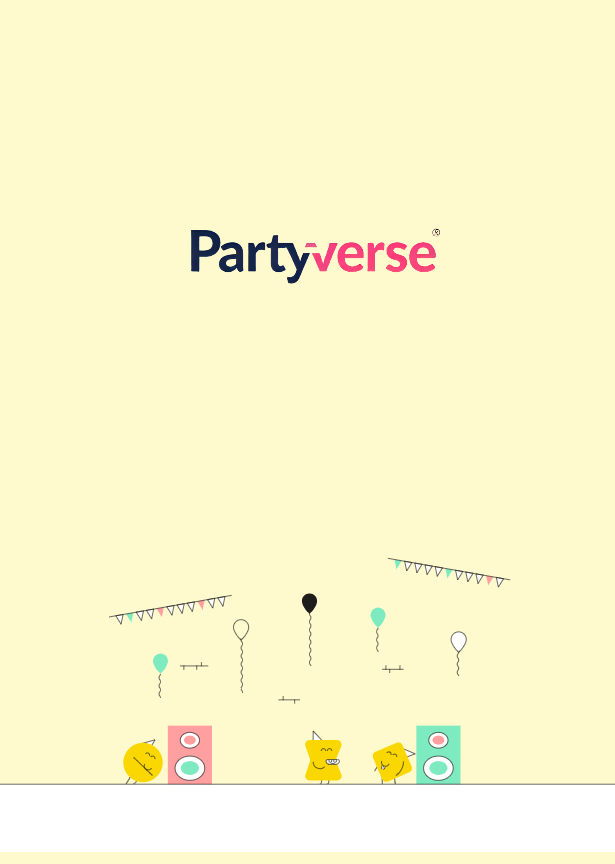
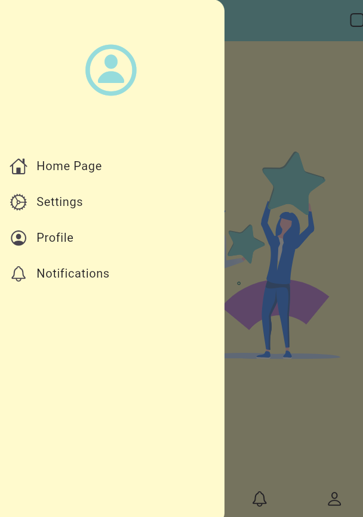

### **PARTYVERSE: Flutter Projesi**  
**Eğlenceye açılan kapı!**  
---  

#### **Proje Hakkında**  
**Partyverse**, eğlence malzemeleri ve kutlama ekipmanları satan, dünya çapında bir marka olmayı hedefleyen bir projedir. Uygulama, kullanıcılarına hem eğlenceli hem de profesyonel bir deneyim sunmayı amaçlamaktadır.  

---  

#### **Ekibimiz**  
- **Danışman**: [Keyvan Arasteh](https://github.com/keyvanarasteh)  
- **Takım Üyeleri**: [BrieflyMR](https://github.com/BrieflyMR)  

---  

#### **Özellikler**  
- **Hızlı Erişim ve Arama**: Kullanıcıların ürünlere kolayca ulaşmasını sağlar.  
- **Tema Tabanlı Kategoriler**: Etkinlik türüne göre özel tasarlanmış kategoriler.  
- **Kişiselleştirilmiş Parti Önerileri**: Kullanıcıların tercih ve geçmiş alışverişlerine göre öneriler.  

---  

#### **Kullanılan Teknolojiler**  
- **Framework**: Flutter  
- **Programlama Dili**: Dart  

---  

#### **Başlangıç**  

##### **Gereksinimler**  
- Flutter SDK (Sürüm: **3.24.5**)  
- Dart SDK (Sürüm: **3.5.4**)  

##### **Kurulum Adımları**  
1. Projeyi bilgisayarınıza indirin:  
   ```bash
   git clone [https://github.com/BrieflyMR/MR-Flutter.git]
   ```  
2. Proje klasörüne gidin:  
   ```bash
   cd [MR-Flutter]
   ```  
3. Gerekli paketleri yükleyin:  
   ```bash
   flutter pub get
   ```  
4. Uygulamayı başlatın:  
   ```bash
   flutter run
   ```  

---  

#### **Proje Yapısı**  
```plaintext
lib/
├── core/    # Hafıza,tema,navigasyon ve yönlendirme ögeleri
├── screens/    # Uygulama ekranları
├── services/     # API sevisleri
└── widgets/   # Tekrar kullanılabilir arayüz öğeleri
```  

---  

#### **Ekran Görüntüleri**  






---  

#### **Projeye Katkı Sağlama**  
1. Projeyi forklayın.  
2. Yeni bir dal oluşturun:  
   ```bash
   git checkout -b ozellik/YeniOzellik
   ```  
3. Değişikliklerinizi kaydedin:  
   ```bash
   git commit -m 'Yeni özellik eklendi'
   ```  
4. Dalınıza gönderin:  
   ```bash
   git push origin ozellik/YeniOzellik
   ```  
5. Pull Request oluşturun.  

---  

#### **Lisans**  
Bu proje, [Lisans Türü] kapsamında lisanslanmıştır. Daha fazla bilgi için **LICENSE** dosyasını inceleyebilirsiniz.  

---  

#### **İletişim**  
- **Proje Bağlantısı**: [GitHub - Partyverse](https://github.com/BrieflyMR/MR-Flutter)  
- **İstinye Üniversitesi**: [www.istinye.edu.tr](https://www.istinye.edu.tr/)  

---  

#### **Teşekkürler**  
Bu projeye katkılarından dolayı **İstinye Üniversitesi**'ne teşekkür ederiz.  